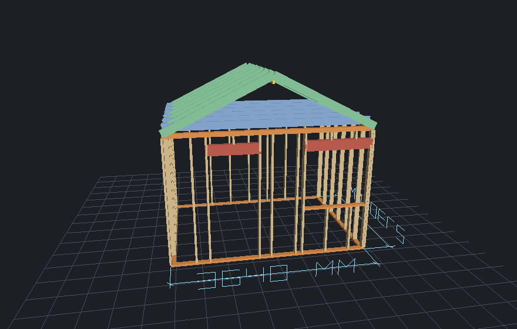
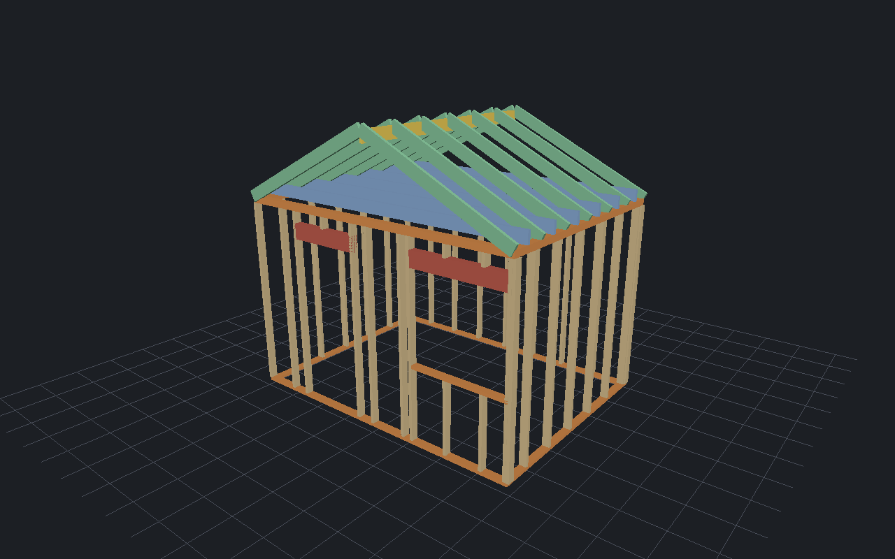
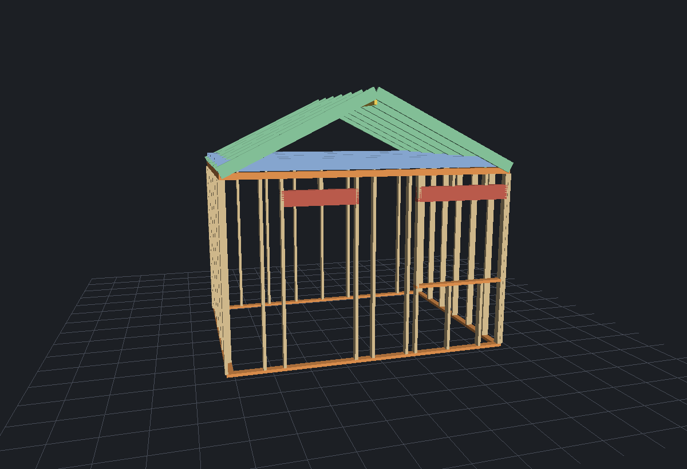
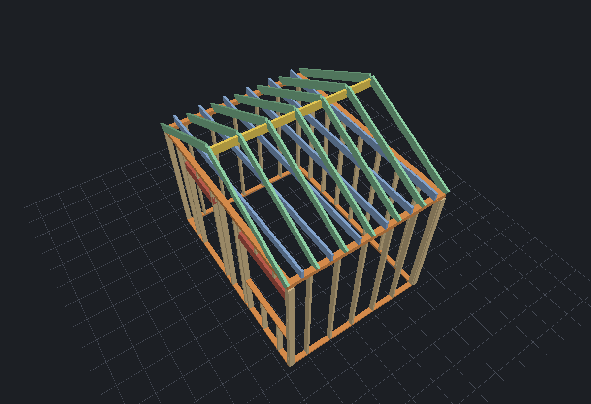
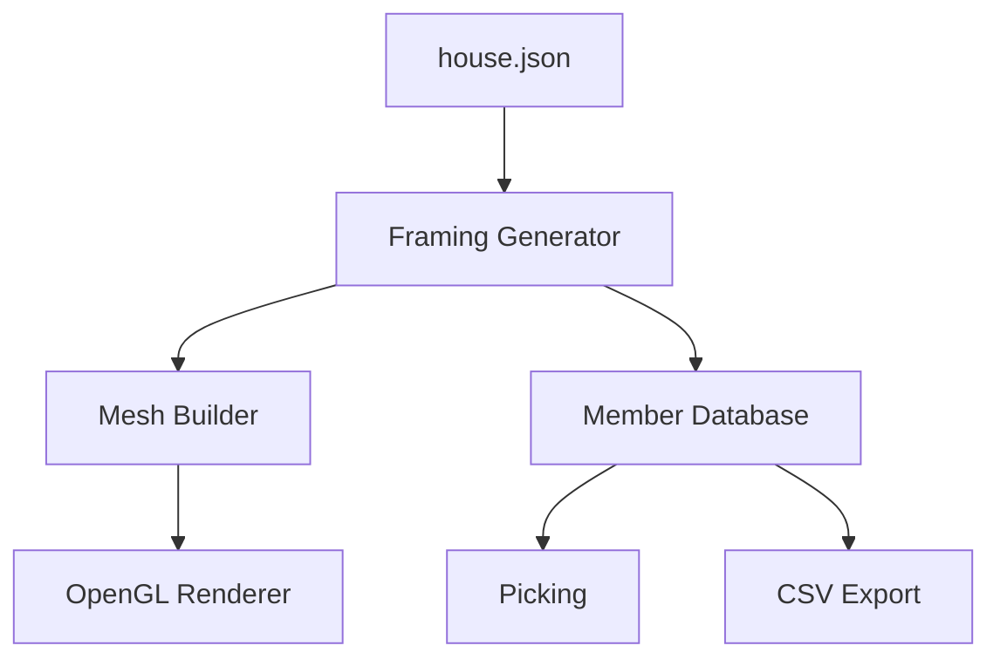

# FrameLens

### Data-driven 2×4 Framing Mini-CAD — C++17 / OpenGL 3.3 Core

<!-- Technical Highlights -->




FrameLens is a data-driven 2×4 framing Mini-CAD built with C++17 and OpenGL 3.3 Core.
It procedurally generates framing members, supports picking, dimensions, JSON configuration, and CSV export.

2×4（枠組壁工法）建築の構造フレームを実寸で手続き的に生成し、
部材クリック選択・部材ID・断面・材長・ゾーン表示・寸法線注記・JSON 入力に対応します。

貴社の主力である 2×4 建築向け CAD・生産支援システムのドメインに寄せ、
「C++ / Windows / 3D グラフィックス（OpenGL）」という開発環境を想定して自作しました。
**外部の数学・JSON・UI ライブラリは一切使わず**、行列演算・カメラ・ピッキング・
JSON パーサ・ストロークフォント・レンダリングまでを自前で実装しています。



---

## Features

- ✅ OpenGL 3.3 Core Rendering
- ✅ Procedural 2×4 Framing Generation
- ✅ Ray Picking
- ✅ Member ID / Zone Assignment
- ✅ Material Classification
- ✅ Dimension Rendering
- ✅ JSON-driven Configuration
- ✅ CSV Export
- ✅ Custom Linear Algebra
- ✅ Custom JSON Parser

```
Language     : C++17
Graphics     : OpenGL 3.3 Core
Members      : 71+  (procedurally generated)
JSON Input   : Supported
CSV Export   : Supported
Platforms    : Windows / macOS / Linux
```

---

## これは何を示すためのものか

| 貴社の要件・環境 | 本アプリでの対応 |
|---|---|
| 開発言語 **C++** | C++17。標準ライブラリのみ（追加ライブラリは GLFW/GLEW のみ） |
| 開発ツール **Visual Studio** | CMake で `.sln` を生成しそのまま Visual Studio で開ける |
| **3D グラフィックス（OpenGL）** | OpenGL 3.3 Core（シェーダ／VAO／VBO）。`glm` 不使用の自作行列演算 |
| **Windows ソフトウェア** | Windows / macOS / Linux で同一ソースからビルド可能 |
| **建築業界・CAD ドメイン** | 2×4 部材を実寸(mm)で生成し、拾い出し・寸法注記・部材識別まで |
| **お客様要望 → 仕様 → 製品** | 建物仕様を `house.json` から入力。幅・奥行・窓/ドア位置を変更可能 |

---

## CAD / BIM 的な機能

- **部材クリック選択（ピッキング）** — マウスクリックでレイを飛ばし、各部材の
  AABB（回転部材はローカル空間）と交差判定。最近傍の部材を選択します。
- **部材の識別（BIM の入口）** — 全部材に **ID**（例 `S-014`）と **ゾーン**
  （`South` / `North` / `East` / `West` / `Floor` / `Roof`）を付与。
  選択するとタイトルバーとコンソールに以下を表示します。

  ```
  ID       : S-014
  Type     : Stud
  Zone     : South Wall
  Section  : 38 x 89 mm
  Length   : 2286 mm
  Material : SPF 2x4
  ```

- **ハイライト** — 選択部材を黄色で強調（少し拡大したメッシュを上描き）。
- **寸法線注記** — 全体の幅・奥行を CAD 風の寸法線（補助線・端末チック・数値）で表示。
  数値は依存ライブラリを足さず、**線分によるストロークフォント**で世界座標に描画。
- **CSV エクスポート** — `C` キーで `framelens_export.csv` を書き出し。
  ID / Type / Zone / Material / Section / Length を出力し、積算・見積ツールへの接続を想定。
- **JSON 入力** — `--in house.json` で建物仕様を読み込み。寸法・開口を変えるだけで
  フレーム・拾い出し・寸法線がすべて追従します。

| 妻面（垂木・棟木・合掌） | 屋根伏せ（垂木・棟木・天井根太） |
|---|---|
|  |  |

---

## Architecture



---

## フレーム生成の中身

幅・奥行・階高・尺モジュール(455mm)・屋根勾配から、
土台／スタッド／二重上枠／まぐさ／窓台／クリップル／天井根太／垂木／棟木を自動生成。
開口部（玄関ドア・窓）はまぐさとたて枠まで正しく組みます。
2×4=38×89mm、2×6=38×140mm、2×8=184mm など実断面。
起動時に**拾い出し（部材種別ごとの本数・総材長）**を出力します（貴社の
「CAD → 見積・積算」ワークフローを意識した最小デモ）。

---

## 操作

| 入力 | 動作 |
|---|---|
| マウス左クリック | 部材を選択（ID・断面・材長・ゾーンを表示） |
| マウス左ドラッグ | 回転（オービット） |
| スクロール | ズーム |
| `W` | ソリッド / ワイヤーフレーム 切替 |
| `G` | 参照グリッド 表示切替 |
| `D` | 寸法線 表示切替 |
| `C` | CSV エクスポート（`framelens_export.csv`） |
| `P` | スクリーンショット保存（`screenshot.ppm`） |
| `R` | 視点リセット |
| `Esc` | 終了 |

---

## house.json のスキーマ

```json
{
  "width":      4550,
  "depth":      3640,
  "wallHeight": 2400,
  "studPitch":  455,
  "roofRise":   1100,
  "openings": [
    { "type": "door",   "x": 900,  "width": 900,  "sill": 0,   "head": 2000 },
    { "type": "window", "x": 2700, "width": 1600, "sill": 800, "head": 2000 }
  ]
}
```

未指定の項目はデフォルト値が使われます。

---

## ビルド

依存: **OpenGL / GLFW3 / GLEW**、CMake 3.16+、C++17 コンパイラ。

### Windows（Visual Studio + vcpkg）
```bat
vcpkg install glfw3 glew
cmake -S . -B build -DCMAKE_TOOLCHAIN_FILE=<vcpkg>/scripts/buildsystems/vcpkg.cmake
cmake --build build --config Release
build\Release\framelens.exe --in house.json
```
`cmake --open build` で Visual Studio のソリューションとして開けます。

### macOS
```sh
brew install glfw glew cmake
cmake -S . -B build && cmake --build build -j
./build/framelens --in house.json
```

### Linux
```sh
sudo apt install libglfw3-dev libglew-dev libgl1-mesa-dev cmake g++
cmake -S . -B build && cmake --build build -j
./build/framelens --in house.json
```

### ヘッドレスでスクリーンショット
```sh
./build/framelens --in house.json --shot out.ppm --size 1280x800 --select 40
# ディスプレイの無いサーバなら: xvfb-run -a ./build/framelens --shot out.ppm
```

---

## 構成

```
framelens/
├─ CMakeLists.txt        # OpenGL / GLFW / GLEW を検出（vcpkg・pkg-config 両対応）
├─ house.json            # サンプル建物仕様
├─ src/
│  ├─ main.cpp           # ウィンドウ・入力・ピッキング・描画・ヘッドレス書き出し
│  ├─ linalg.hpp         # 自作 Vec3 / Mat4（透視投影・lookAt・rayAABB）
│  ├─ camera.hpp         # オービットカメラ
│  ├─ json.hpp           # 自作の最小 JSON パーサ
│  ├─ framing.hpp/.cpp   # フレーム生成・メッシュ化・寸法線・拾い出し・部材情報
│  └─ shaders.hpp        # GLSL とコンパイル補助
└─ docs/                 # README 用の描画画像
```

設計方針は「生成（framing）／表現（linalg・camera）／描画（main・shaders）／
入力（json）」を分離し、部材モデルや入力形式を差し替えても他に波及しないようにしています。

---

## 今後の拡張余地

- パネル割付・面材の自動配置、部材同士の干渉チェック
- 拾い出し結果の見積書出力（貴社の積算フローへの接続）
- 部材プロパティ（樹種・グレード・耐力）の付与 → 本格的な BIM 化
- DXF / IFC など CAD 交換フォーマットの入出力

---

## Why I Built This

I wanted to go beyond rendering a 3D model and build a small CAD-like application.
The project focuses on procedural framing generation, member identification, picking,
and data-driven building configuration rather than graphics alone.
It was created to demonstrate how C++ and OpenGL can be applied to real architectural software.

---

*Author: みぜ / 建築ドメインの理解と C++・OpenGL の実装力を示すための自作デモです。*
